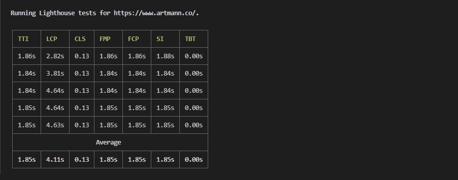

# Lighthouse Report

Lighthouse performance scores will change due to inherent variability in web and network technologies, even if there hasn't been a code change. This CLI tool will run the Lighthouse multiple times and report back.

## Install

NPM

```sh
npm install -g lighthouse-report
```

Yarn

```sh
yarn global add lighthouse-report
```

## Use

```sh
lighthouse-report https://github.com/
```
